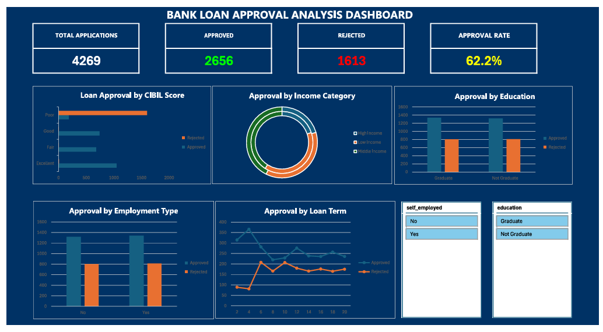

# Bank Loan Approval Analysis Dashboard
### End-to-End Excel Project | Data Analytics Portfolio

---

## Project Overview

This project analyzes **4,269 bank loan applications** to identify key factors that influence loan approval or rejection. Built entirely in **Microsoft Excel**, this end-to-end dashboard helps banking institutions make data-driven lending decisions.

---

## Business Problem

Banks receive thousands of loan applications daily. The challenge is to identify **which factors most strongly predict loan approval** — enabling faster, fairer, and more accurate lending decisions.

---

## Dataset

| Detail | Info |
|--------|------|
| Source | Kaggle — Loan Approval Prediction Dataset |
| Rows | 4,269 applications |
| Columns | 13 features |
| Target | Loan Status (Approved / Rejected) |

**Key Features:**
- `cibil_score` — Credit score (300–900)
- `income_annum` — Annual income
- `loan_amount` — Requested loan amount
- `loan_term` — Duration in years
- `education` — Graduate / Not Graduate
- `self_employed` — Yes / No
- `residential_assets_value`, `commercial_assets_value`, `luxury_assets_value`, `bank_asset_value`

---

## Tools Used

**Microsoft Excel 365**
- Data Cleaning (Formulas, Filters)
- Derived Columns (IF, Nested IF)
- Pivot Tables
- Interactive Dashboard (Charts + Slicers)

---

## Project Workflow

Raw Data → Data Cleaning → Derived Columns → Pivot Analysis → Dashboard → Insights

### Step 1 — Data Cleaning
- Checked for duplicates → None found
- Checked for blank cells → None found
- Verified data types and formats

### Step 2 — Derived Columns Created

| Column | Logic |
|--------|-------|
| `cibil_category` | Poor / Fair / Good / Excellent based on score |
| `income_category` | Low / Middle / High Income based on annual income |
| `total_assets` | Sum of all 4 asset columns |

### Step 3 — Pivot Table Analysis
5 pivot tables created to analyze approval patterns across CIBIL Score Category, Income Category, Education Level, Employment Type, and Loan Term.

### Step 4 — Interactive Dashboard
- 4 KPI Cards (Total Applications, Approved, Rejected, Approval Rate)
- 5 Charts (Bar, Donut, Column, Line)
- 2 Interactive Slicers (Education, Employment Type)

---

## Dashboard Preview

### KPI Summary:

| Metric | Value |
|--------|-------|
| Total Applications | 4,269 |
| Approved | 2,656 |
| Rejected | 1,613 |
| Approval Rate | **62.2%** |

---

## Key Business Insights

### 1. CIBIL Score is the #1 Approval Factor
- Applicants with Excellent CIBIL (750+) have a **99.4% approval rate**
- Applicants with Poor CIBIL face **89% rejection rate**
- **Recommendation:** Bank should fast-track applications with CIBIL > 750

### 2. Income Level Alone Does NOT Determine Approval
- Low Income applicants still achieved **63% approval rate**
- High Income applicants face **38% rejection**
- **Recommendation:** Asset evaluation should be weighted alongside income

### 3. Education Has Minimal Impact
- Graduate Approval: **62.5%**
- Not Graduate Approval: **61.9%**
- **Recommendation:** Education should be removed as a primary loan criteria

### 4. Self Employment Does NOT Affect Approval
- Salaried: **62.2%** Approved
- Self Employed: **62.2%** Approved
- **Recommendation:** Self-employed applicants deserve equal evaluation treatment

### 5. Short Term Loans Show Higher Rejection
- 2-year loan term shows the highest rejection rate
- Longer terms correlate with more approvals
- **Recommendation:** Bank should offer flexible EMI restructuring for short-term applicants

---

## Files in Repository

- `bank_loan_dashboard.xlsx` — Main Excel file with Dashboard
- `loan_approval_dataset.csv` — Raw dataset
- `screenshot.png` — Dashboard screenshot
- `README.md` — Project documentation

---

## How to Use

1. Download `bank_loan_dashboard.xlsx`
2. Open in Microsoft Excel 365
3. Go to **Dashboard** sheet
4. Use **Slicers** to filter data interactively
5. Check **Insights** sheet for business recommendations

---

## Author

**Nitesh Sharma**
Data Analytics Enthusiast
- LinkedIn: https://www.linkedin.com/in/nitesh-sharma-b55974232/
- GitHub: https://github.com/niteshsharmaattri
